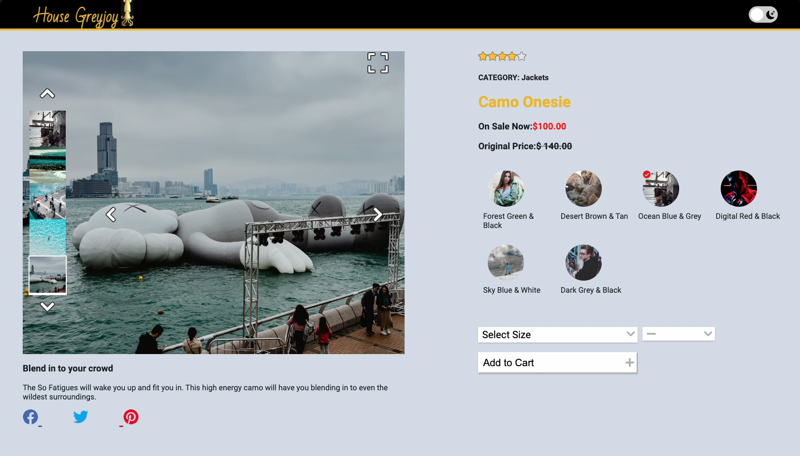

<h1> Greyjoy Fashions</h1>

<h2>Table of Contents</h2>

-  [Project description](#project-description) 
-  [Tech Stack](#-tech-stack-)
-  [Application Structure](#-application-struture-)
-  [Installation and Set-up](#installation-and-set-up)

**<h2 style="text-decoration:underline;">Project Description</h2>**

This project is designed to emulate a professional development project wherein clients have requested a functional mock-up of a new e-commerce product landing page. The page is comprised of several core functions, including product images and the cart, a searchable Q&A section and finally, a sortable reviews component. For efficiency, our project team worked collectively on shared functionality, such as the server and App component, and divided further work into each of the respective areas of functionality.

**<h2 style="text-decoration:underline;"> Tech Stack </h2>**

**<h2 style="text-decoration:underline;"> Application Struture </h2>**

**<h3 style="text-decoration:underline;">Server: </h3>**

The server is located in the ‘server’ directory in the file ‘index.js’.  Its functionality is streamlined making use of only a few middleware, most notably node’s built-in file compression. The remainder of the file is for various routes, exclusively ‘get’, ‘post’, and ‘put’ requests, that handle external calls to the Atelier API.

**<h3 style="text-decoration:underline;">App:</h3>**

The App.jsx file in the /client/src directory houses all of the high-level components for our app. It includes two initial ajax requests to our server to be fired upon the page loading. The data received from these requests is then passed down as props to the child components that rely on the data received.

**<h3 style="text-decoration:underline;">Header:</h3>**

A sibling component to App.jsx, this renders the ‘House Greyjoy’ name, logo and the day/night mode toggle.

**Product Overview:**

* The Product Overview component is contained in the View directory located within ‘client/src/components’. The file ‘View’ serves as the parent component which displays the following components and their respective functionalities:
* Product Image: Displays the main image. This component also has the child components of Carousel, which is visible as the vertical image gallery on the left side of the main image, and ExpandedPhoto, which is a modal that displays a larger, zoomable image if the user clicks the main image.
* Description: Located beneath the main image, this component contains the product tag line and description as well as social media share icons.

* StyleView: This is a styled component to group the following sub-components:
    * ProductName: This displays the product name, category, overall star rating, price and/or sales price.
    * SelectedStyle: This component is conditionally rendered in the event that a product has multiple designs/colors. It is visible as a series of circular images with the associated style names.
    * ItemSelection: This component is the cart functionality. It allows users to select a particular style of a product and choose amongst the sizes and associated quantities of each item and add it to their cart. The majority of the cart functionality is stored within the View component in the function “addToCart”.

* Also within the View directory is a subdirectory ‘Styled’. This directory contains all of the styled components related to the View components.

**<h3 style="text-decoration:underline;">Q&A Widget:</h3>**

The main features of this component are the questions feed, a search bar and the add questions or add answers modals. Each question in the questions feed has its own answer feed. Both feeds have an initial load count of 2. The questions feed is also currently just displaying answered questions as per the business docs. The search bar starts searching once the term is 3 characters long, and searches for matching question or answer text, displaying all answers if the question name contains the term but only the answers matching the search when only answer body text matches. The add questions modal is almost useless without postman or some other way to see data, since only answered questions will display. The add answers modal will reperform the get request and load the answer into the feed on submission.

**<h3 style="text-decoration:underline;">Reviews:</h3>**

The Reviews component consists of a rating summary, a reviews list, a sortable dropdown indicating the current sorting specifications, and two buttons to allow users to either add a new review, or view more reviews in the list. The file ‘Reviews’ component serves as the parent component which displays the following components and their respective functionalities:

* Summary: This component houses the breakdown of review meta data retrieved from the API. It consists of an average star rating component, a breakdown of review percentages by star rating, and a sliding scale to indicate overall customer satisfaction with any given characteristics of the product. There is additive filtering functionality on the star rating bars that allows users to filter the list by star rating.
* Reviews List: This component renders a list of reviews received from the API. Each individual list entry contains multiple pieces of data and positions them on the entry in a professional, readable format.

* More Reviews and Add a Review: These button components live at the bottom of the reviews list. Clicking on More Reviews renders two additional reviews to the list. Clicking on Add a Review brings up a modal window with a form to complete for writing your own review. This form includes rating the product and its specific characteristics, as well as text inputs and a button to allow the user to upload photos from their computer or from the web.

**<h2 style="text-decoration:underline;">Installation and Set up:</h2>**
1. Run npm install to install dependencies (listed below).
2. Copy config.example.js in the client/src/config and remove example from the name so it is ignored. Then fill in your GitHub api key.
3. Run npm run client-dev to have webpack dev run and continue watching,
    or npm run build to compile a production build.

4. Run npm run-server-dev to start the server up.
5. The port is currently set to  3001 to change that simply change the number in app.listen at the bottom of server/index.js

